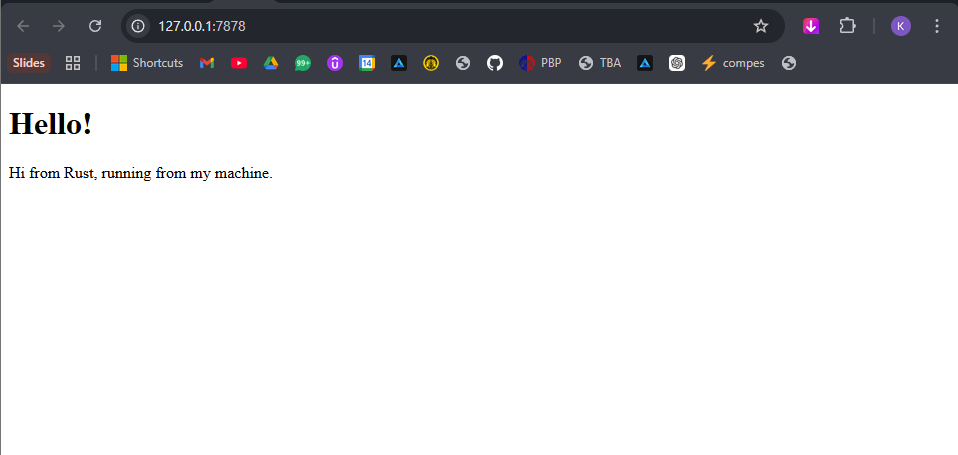
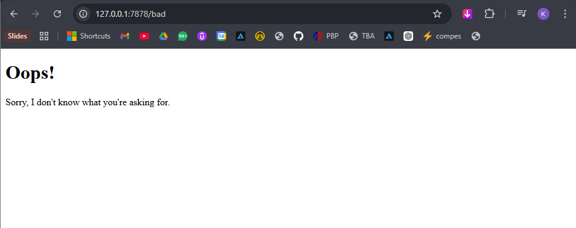

## Commit 1 Reflection
BufReader, wraps the TcpStream and provides buffered reading.  Instead of reading one byte at a time directly from the stream, it reads chunks of data into a buffer, making it more efficient to read line by line.

.lines(), returns an iterator over the lines of the stream. Each item in the iterator is a Result<String>, so we use .map(|result|result.unwrap()) to extract the actual String value from each line.

.take_while(|line| !line.is_empty()) stops at an empty line because in HTTP the headers are separated from the body by a blank line so .take_while(|line| !line.is_empty()) keeps reading lines until it hits that empty line, which means we only collect HTTP request headers and nothing else.

final Vec contains all the HTTP request header lines as String:

"GET / HTTP/1.1",

"Host: 127.0.0.1:7878",

"Connection: keep-alive",

## Commit 2 Reflection
fs::read_to_string, is used to more conveniently read entire contents of a file into a single string. The server then contructs a proper HTTP response with status line 'HTTP/1.1 200 ok', 'Content-Length' header to know how many bytes expected, blank line ('\r\n\r\n') to seperate header from body, and HTML content. ntent-Length, is a HTTP header used to indicate the size of the request or response body in bytes.

when opening http://127.0.0.1:7878, the browser successfully rendered the HTML page with

Hello!

Hi from Rust, running from khay's machine

hence confirming that the server now reads the HTML file and serve it as a proper HTML response.

## Commit 3 Reflection
Why refactoring is needed, without it there would be duplicated code inside each branch of the if/else, file-reading, length calculation, formatting, and writing to the stream were all copy-pasted for both the 200 and 404 cases. this means any change to how responses were built had to be applied twice which makes it harder to maintain

How to split between responses, The if/else block handles routing only, it picks the right status_line and filename based on the request. everything else is a shared response logic that runs once regardless of which route matched. Since both routes need the same steps,read the file, get the length, format the response, write to the stream those steps now live in one place. Adding a new route only requires a new branch in the if/else, not duplicating the send logic again.

## Commit 4 Reflection
- http://127.0.0.1:7878/sleep took 10 seconds to load
- http://127.0.0.1:7878 had to wait until /sleep finished 
before it could load, even though it should have been instant

This happens because our server is single-threaded. It can only handle one request at a time. When /sleep is being processed, the server is completely blocked by thread::sleep(Duration::from_secs(10)) and cannot accept or process any other incoming requests until it finishes.
In a real-world scenario, imagine hundreds of users trying to access your server at the same time. If even one request is slow, every other user has to wait in line. This makes the server feel unresponsive and unusable under heavy load. This is exactly the problem that multi-threading solves, which we will implement in the next milestone.

## Commit 5 Reflection
- Tab 1: http://127.0.0.1:7878/sleep took 10 seconds as expected
- Tab 2: http://127.0.0.1:7878 loaded immediately without waiting
Terminal showed Worker X got a job; executing. confirming that different workers were handling different requests concurrently.

When ThreadPool::new(4) is called, it creates a single mpsc channel think of it as a conveyor belt and spins up 4 worker threads. The sending end of the channel is kept by the ThreadPool, and the receiving end is wrapped in Arc<Mutex<...>> so all 4 workers can safely share it. Each worker immediately enters a loop, blocking and waiting for a job to appear on that shared receiver.

When pool.execute(|| handle_connection(stream)) is called, the closure is boxed into a Job and sent down the channel. Whichever worker thread isn't busy grabs the lock on the receiver, pulls the job off, releases the lock, and runs the closure. The other workers keep waiting. This means multiple connections can be handled at the same time — up to 4 concurrently instead of one at a time.

When the ThreadPool is dropped (e.g. the server shuts down), the Drop impl runs. It first drops the sender, which closes the channel. When workers try to recv() on a closed channel, they get an Err, hit the break, and exit their loop. The main thread then calls join() on each worker to wait for them to finish whatever job they're currently running before the program exits cleanly.

